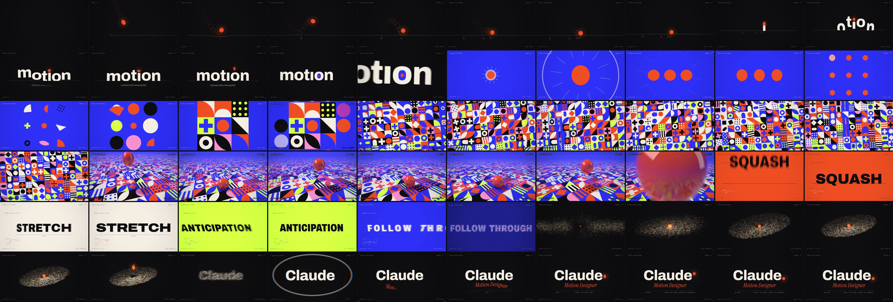
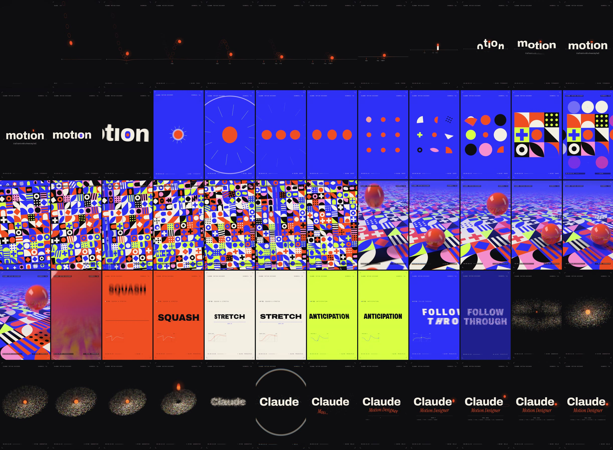

# Claude — Motion Reel ’26

**A 15-second motion design showreel, made entirely from code.** No After Effects,
no stock footage, no samples, no AI video generation: 900 frames produced by a
deterministic renderer where every frame is a pure function of time, and a
soundtrack synthesized sample-by-sample and scored to the renderer's own events.

▶ **[`output/claude-motion-reel-2026.mp4`](output/claude-motion-reel-2026.mp4)** — landscape 1920×1080 · 60 fps · H.264 + AAC · 15.000 s
▶ **[`output/claude-motion-reel-2026-vertical.mp4`](output/claude-motion-reel-2026-vertical.mp4)** — vertical 1080×1920 for Reels / Shorts / TikTok · same timing and score



## The idea: *it all starts with a bouncing ball*

The bouncing ball is Animation 101 — the first exercise every animator does. Here
it's the hero character: it travels through every style in the reel and ends as
the full stop in the name. Everything is locked to **128 BPM** (8 bars = exactly
15.0 s), and one timeline file drives both picture and sound.

| Beats | Time | Shot | What it shows |
|---|---|---|---|
| 0–4 | 0.00–1.88 | **Timing** — a physically timed bounce (restitution 0.5 → the accelerating *tok . . tok . tok‑tok‑trrr*), onion skins, frame-number timing chart, a floor line that flexes under each impact | Timing, spacing, arcs, squash & stretch |
| 4–8 | 1.88–3.75 | **Typography** — *motıon* rises out of the floor line in a ripple from the ı, whose stem lifts the ball into place as its tittle; the word flexes its variable-font width axis; the ball hops into the “o”, which opens as a portal, and the camera accelerates through the counter | Kinetic type, match-moves, camera |
| 8–20 | 3.75–9.38 | **Shape → Systems → Dimension** — one continuous shader “oner”: the ball splits 1 → 3 → 9 (SDF metaballs), the blobs morph into Bauhaus motifs, coin-flip into their colours and claim a 3×3 grid; the camera pulls back to an infinite generative tile system with rotation / flip / morph waves; then the flat grid tilts into 3D and a lacquered ball drops onto it, rippling the tiles, before launching into the lens | SDF shape design, generative systems, 3D, one-shot transitions |
| 20–24 | 9.38–11.25 | **Principles** — SQUASH, STRETCH, ANTICIPATION, FOLLOW THROUGH: each word *performs* its principle, with a live graph-editor widget plotting the real curve driving it | The 12 principles, applied to type |
| 24–32 | 11.25–15.00 | **Generative → Hello** — the last word shatters into 6,200 particles that spiral into a depth-sorted galaxy around the ball, accelerate with the riser and slam into the wordmark on the final downbeat; the ball returns as the period: **Claude.** | Particles, build & release, end card |

## Two formats, one timeline

The vertical cut is a re-layout, not a crop: every shot reads the active format
(`?format=vertical`) and re-composes itself for 9:16 while the choreography,
physics and score stay identical. The bounce drops from higher (stronger gravity
keeps it on the beat), words are auto-fit to the frame width, FOLLOW / THROUGH
stacks onto two lines, the camera frames the 3×3 core by width, the galaxy
becomes a rounder, tilted disc, the end card stacks its details, and the HUD
grows for phone screens. Each format exports its own event times, so the
soundtrack is re-scored to the frame for each.



## Under the hood

**Renderer** (`showreel/src`) — a Canvas 2D + WebGL2 compositor that runs in headless Chromium.
- **Real motion blur:** each output frame integrates 6 sub-frame samples across a 180° shutter, composited in *linear light* into a half-float buffer (no banding, physically plausible streaks). Samples are sub-pixel jittered, so the shader shots get supersampled anti-aliasing for free.
- **Lens pass:** chromatic aberration, barrel “punch” and shake keyed to impacts, flashes, vignette, triangular dither; film grain is added at encode time (luma only).
- **The oner** (`shots/world.glsl.js`) is one fragment shader whose 2D top-down view and 3D perspective share the same camera and floor function, so the flat grid can tilt into a floor without a cut. Blobs are smooth-min SDFs; the tile system is 12 SDF motifs × a palette of colour pairs with hashed choreography; the ball is an analytically ray-traced squash-and-stretch ellipsoid with Fresnel lacquer, softbox reflections of the live floor, analytic soft shadows and occlusion. Programs are specialised per phase with `#define`s and the ball/blob passes are scissored to their projected bounds (≈2.5× faster on SIMD-masked GPUs).
- **Typography:** Archivo's variable `wdth` axis is animated continuously from canvas by registering one `FontFace` per width with a fixed `stretch` descriptor; glyph geometry (the i's tittle, the o's counter) is measured from the rendered font so the ball lands exactly where the real dot would be.
- **Motion toolkit** (`lib.js`): Penner easings, CSS-style cubic-bézier curves, damped-spring step/impulse responses, simplex noise, seeded PRNGs.

**Soundtrack** (`showreel/audio/synth.mjs`) — ~700 lines of from-scratch DSP: PolyBLEP oscillators, a
TPT state-variable filter, FM electric piano, supersaw pads, 808-style hats, synthesized kick/clap/snare,
Freeverb, ping-pong delay, sidechain ducking, glue compression and a look-ahead limiter (≈ −14 LUFS, < −1 dBTP).
A 128 BPM nu-disco cue in C major (Fmaj7 → G6 → Em7 → Am7, resolving to Cmaj9 on the logo).
`tools/events.mjs` exports the renderer's physically derived event times (bounce landings, tittle landings,
tile pop-ins, splits, flips…) so every sound effect lands on its exact frame.

## Render it yourself

Requirements: Node 18+, Playwright's Chromium, and ffmpeg (`ffmpeg` on `PATH`, `pip install imageio-ffmpeg`, or `FFMPEG=/path/to/ffmpeg`).

```bash
npm install                      # playwright (browsers: npx playwright install chromium)
npm run render                   # events → soundtrack → 900 frames → output/claude-motion-reel-2026.mp4
npm run render:vertical          # the 9:16 re-layout → output/claude-motion-reel-2026-vertical.mp4
node tools/render.mjs --gpu      # use the machine's GPU instead of SwiftShader (much faster)
node tools/stills.mjs --range 0:899:15 --sheet sheet.png --cols 10   # contact sheet for review
npm run preview                  # real-time playback in the browser (1 sample, click to play)
                                 # vertical preview: /showreel/index.html?live&format=vertical
```

## Credits

Typefaces under the SIL Open Font License (licenses in `showreel/fonts/`):
[Archivo](https://github.com/Omnibus-Type/Archivo) (Omnibus-Type),
[Instrument Serif](https://github.com/Instrument/instrument-serif) (Instrument),
[JetBrains Mono](https://github.com/JetBrains/JetBrainsMono) (JetBrains).
Everything else — design, animation, code and sound — was made for this reel.
